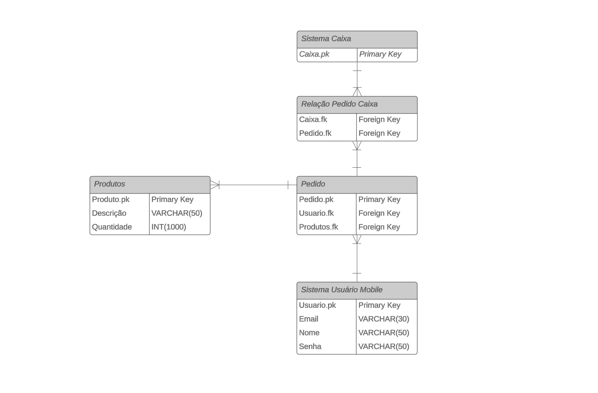

# Projeto Integrador - Co-off
Co-off
Um modelo para o desenvolvimento do Projeto Integrador do Curso de Técnico em Desenvolvimento de Sistemas para a Internet Integrado ao Ensino Médio do IFC - Campus Araquari.

A ideia do nosso site é trabalhar com um sistema de anúncio de veículos prático e rápido, incialmente como base para um projeto futuro, vendo que no mercado atual diversas empresas visam o dinamismo da entrega de informações, por meio do visual atrativo dos sites e do fácil acesso as informações, além de um sistema básico de cadastro de itens pelo administrador do site, a ideia do projeto é buscar essa praticidade em meio a um cotidiano acelerado além de ser uma boa estratégia de entrada no mercado virtual, tanto nacional, quanto internacional.

**IMPORTANTE**: [**Cadastre seu projeto nesse link**](https://docs.google.com/spreadsheets/d/165xR63Yy9C75saQX-I_RsZV-hTrdiToei5Ave0JU1uQ/edit?usp=sharing).

Professor: [Marco André Mendes](github.com/marcoandre)

Equipe:
<a href="github.com/danielhinsching">-Daniel</a>
- [Luís](github.com/luisc5martins)
- [Pedro](github.com/luisc5martins)

Links do projeto:
-   [Documentação (esse documento)](github.com/danielhinsching/pi-modelo)
-   Backend: [Repositório](https://github.com/luisc5martins/projeto-garagem) e [Publicação](https://pi-backend.herokuapp.com/)
-   Frontend: [Repositório](https://github.com/luisc5martins/fake-cars) e [Publicação](https://pi-frontend.herokuapp.com/)
-   Figma: [Link](https://www.figma.com/design/2dEfOYPSMhYV2oEPYmzEim/FAKECARS?t=LfNSotsEFVfIicLk-1)

